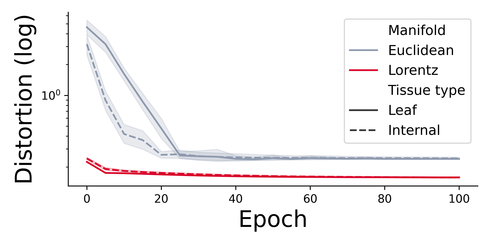
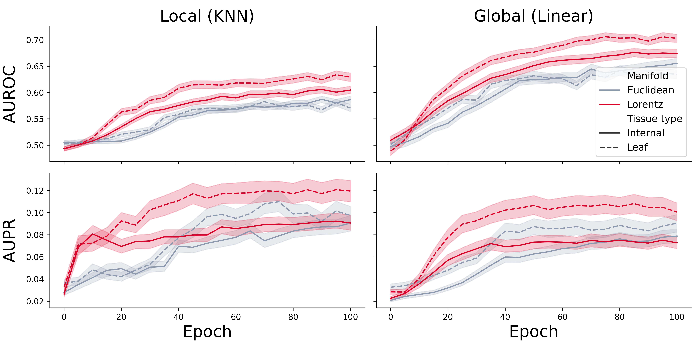
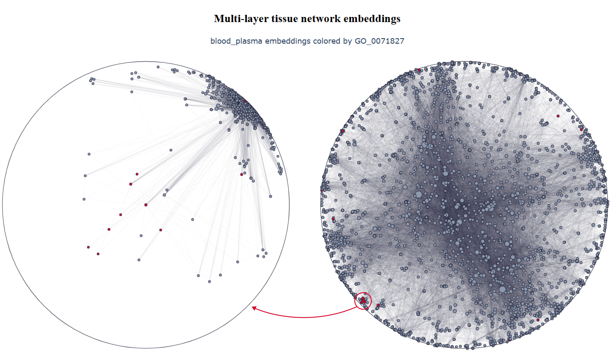

# Hyperbolic representation learning in multi-layer tissue networks
Pytorch implementation of the OhmNet model [[1]](#1) and its non-Euclidean version to the paper "[Hyperbolic representation learning in multi-layer tissue networks](https://www.esann.org/sites/default/files/proceedings/2025/ES2025-21.pdf)."

[ESANN conference poster](ES2025_WED_10_10_21_Pogany_poster.pdf) 

Contact Information: pogany@mit.bme.hu

## Data availability
For the paper, we have utilized the tissue-specific human protein-protein interaction (PPI) networks [[1]](#1) available at [SNAP](https://snap.stanford.edu/ohmnet/).

Before running the notebooks, download the tissue hierarchy, PPI networks, and GO labels from [SNAP](https://snap.stanford.edu/ohmnet/) and unzip them into the `data` folder.

## Contents
- `utils/data.py`: Functions to load the multi-layer tissue network.
- `utils/hyperbolic_utils.py`: Utils for the Lorentz and Poincaré models.
- `utils/node2manifoldvec.py`: Non-Euclidean Node2Vec implementation overriding the PyG class.
- `utils/tissue_embedding.py`: Embedding modules for PPI networks corresponding to leaf and internal nodes in the tissue hierarchy.
- `utils/model.py`: Pytorch implementation of the OhmNet model.
- `utils/node_classification.py`: Utils for the linear and distance-based node classification tasks.
- `hyperbolicity.ipynb`: Investigate the hyperbolicity of the PPI networks.
- `train.ipynb`: Perform unsupervised representation learning and evaluate the embeddings with node classification and graph distortion tasks.
- `results.ipynb`: Compare the evaluation results for embeddings learned based on different configurations, reproducing *Figure 1.* and *Figure 2.*
    <div style="text-align:center">
    
    <p>Mean and 95% confidence intervals are shown for the graph distortions for Euclidean and Lorentzian distances during training. Distortions were evaluated on 144 PPI networks corresponding to both leaf and internal tissues.</p>
    
    <p>Cross-validation results for protein function prediction, showing mean AUROC and AUPR metrics with 95% confidence intervals. Metrics are presented for classifiers leveraging global and local information on Euclidean and hyperbolic embeddings across internal and leaf tissues.</p>
    </div>
- `visualization.ipynb`: After dimensionality reduction, visualize the tissue-specific protein representations, interactively exploring each embedding space with Poincaré translation. Besides the listed requirements, the [PoincareMaps](https://github.com/facebookresearch/PoincareMaps/tree/main) [[2]](#2) is also needed to perform hyperbolic dimensionality reduction.
    <div style="text-align:center">
    
    </div>

## Requirements
The following command can install all libraries required to reproduce the experiments conducted in the paper (currently for CUDA 11.8).
```
conda create -n torch_geometric
conda activate torch_geometric

conda install pytorch==2.3.0 torchvision==0.18.0 torchaudio==2.3.0 pytorch-cuda=11.8 -c pytorch -c nvidia

pip install pyg_lib torch_scatter torch_sparse torch_cluster torch_spline_conv -f https://data.pyg.org/whl/torch-2.3.0+cu118.html
pip install torch_geometric

pip install ipykernel ipywidgets pandas matplotlib jupyter-dash
```

## References
<a id="1">[1]</a> 
Zitnik, M., & Leskovec, J. (2017). 
Predicting multicellular function through multi-layer tissue networks.
Bioinformatics, 33(14), i190-i198.

<a id="2">[2]</a> 
Klimovskaia, A., Lopez-Paz, D., Bottou, L., & Nickel, M. (2020). 
Poincaré maps for analyzing complex hierarchies in single-cell data. 
Nature communications, 11(1), 2966.

## Citation
```
TBA
``` 
